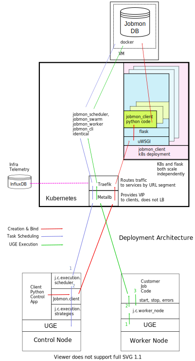

Process View
************

*What calls what.*

UML diagrams to represent process view include the sequence diagram, communication diagram, activity diagram.

*TO DO This section is a sketch*

The Python Client Path
======================
#TO DO Trace the call from the User's Python code:#

The path is shown in the diagram in the `Server & Services`_ section, but the details
of the calls need to be added there.

1. Through Jobmon's Python library:

  #. HTTP to Kubernetes
  #. Metal-lb
  #. UWSGI
  #. Flask
  #. Kubernetes service
  #. Database

The QSUB Path
=============

#TO DO The whole execution_wrapper process, with Popen and exception catches.#

QPID Integration
================

UGE does not accurately record memory usage, specifically Resident Set Size (RSS) or
Proportional Set Size (PSS) from Linux. Qpid (see these
`linked repos <https://stash.ihme.washington.edu/projects/QPID>`_)
was developed to fill the gap.
In brief, QPID has a central database to record accurate runtimes and PSS for every job run on
the cluster, not just those under Jobmon control.
For details see the documentation in the qpid repos.
Jobmon historically relied on
runtime and memory usage reports from ``qstat``, which are inaccurate.

The Jobmon side of the code is jobmon.server.squid_integration.
This is deployed on Kubernetes as a Deployment. Essentially it is while-forever loop
that queries qpid on the ``jobmaxpss`` route to get the maxpss for each completed jobmon job.
It only queries for taks-instances that have recently completed and for which Jobmon does not
yet have QPID resource usage. There are certain corner cases where the usage data will not
be returned,
see https://jira.ihme.washington.edu/browse/GBDSCI-2269
.

Theory: If Jobmon is unable to get usage data from QPID for some time then the list of job
ids in memory will grow without bound, and the squid_integration server could run out of memory.

Resource Retries
================

With the move to the fair (Buster) cluster, resource limits are enforced,
and jobs may die due to cluster enforcement if they have under-requested resources.
In order to help jobs complete without user intervention every time,
Jobmon now has resource adjustment. If it detects that a job has died due to
resource enforcing, the resources will be increased and the job will be retried
if it has not exceeded the maximum attempts.

A record of the resources requested can be found in the executor parameter set
table where each job will have the original parameters requested and the
validated resources as well as rows added each time a resource error occurs
and the resources need to be increased. If this happens, the user should
reconfigure their job to use the resources that ultimately succeeded so that
they do not waste cluster resources in the future.

A step-by-step breakdown of how jobmon deals with a job instance failing due
to resource enforcement is as follows:

1. job instance exits with a resource killed error code
2. The reconciler finds job instances with resource error codes and moves them to state Z.
   The job will be moved into state A (Adjusting Resources) if it has retries available.
3. The job instance factory will retrieve jobs queued for instantiation and
   jobs marked for Adjusting Resources, it will add a new column with adjusted
   resources to the executor parameters set table for that job, and mark
   those as the active resources for that job to use, then it will queue it
   for instantiation using those resources
4. a new job instance will be created, and it will now refer to the new
   adjusted resource values

The query to retrieve all resource entries for all jobs in a dag is::

    SELECT EPS.*
    FROM executor_parameter_set EPS
    JOIN job J on(J.job_id=EPS.job_id)
    WHERE J.dag_id=42;

.. _deployment-view:

Deployment View
***************

*Which pieces of code are deployed where.*

Jobmon is deployed in three places:

- Client, in the same process as the Python control script
- Worker-node, a wrapper container around the actual UGE Task
- Server, as a set of Kubernetes services, defined below

Python Client
=============
This ia standard Python wheel that is pip-installable. At run-time the Python client is within the
Application's Python process and is just an ordinary library. It communicates via http to the
central kubernetes services.

*Strategies aka Executors*

The strategy package is part of the client. It represents the Cluster Operating system.
Jobmon has three at present:

- UGE (aka SGE)
- Sequential (one job after another), and
- Multiprocessing (jobs launched using Python MP)
- Dummy, which does nothing and is used to test Jobmon's internal machinery.

Only the UGE distributor is used in production, the others are useful for testing, and for
the upcoming Jobmon-on-a-laptop deployment.

Be very aware of the difference between where:

1. Where the Jobmon services are deployed (kubernetes or docker), and
2. Where the jobs that Jobmon controls are running.

**These are two separate axes:**

**(Kubernetes, Docker) CROSS (UGE, SLURM, Azure, Python-Sequential, Python-MP, Dummy)**

R-Client & Executor Service
===========================
As of January 2021 we are experimenting with an R-client that calls Python immediately
via the R reticulate package. Each Python API call has an R equivalent.
The Python interpreter runs in the same process as the R interpreter, so values are passed
directly in memory. The translation overhead is not known.

The second step will be to separate all the machinery that is currently in the Python client
into an ExecutorService that will contain the ``scheduler`` and ``strategies`` packages.
Python and R clients will simply use http to communicate with it when necessary. Calls from
the application that are currently synchronous (e.g. execute dag) will become asynchronous.
The executor service could be deployed locally (using Python MP), or deployed centrally as
a highly-scaled kubernetes container.

Worker-node
===========
The worker_node code is inside the Client package, it should move into its own package.

If Jobmon was only supporting UGE then the worker-node code could be moved
to a new top-level package, named worker-node.
However, Jobmon will control jobs on UGE, Azure, and SLURM in the near future, so it will
need a package structure.
UGE and Slurm can probably share the same execution_wrapper because they both run on Linux.
Azure needs a different execution wrapper.
What matters is the worker node operating environment (Linux vs docker), not the cluster OS.
Therefore this package will be moved as part of the port to Azure.

Server & Services
=================

The server package contains the kubernetes services, plus the model objects for communicating
to the mysql database.

As of 2.0 (Guppy) the Jobmon production server is deployed as a series of Kubernetes containers.
Prior to 1.0.3 Jobmon, services were deployed using docker. That docker capability will return
in 2.2 as the "Bootable on a Laptop" feature.

Each container is responsible for the routes from one external system or client.
The containers are organized according to the load they carry, so that they can scale independently:

+-------------------+-----------------------------------------------------+-------------------+
| Container/Package | Description and Comments                            | Domain Objects    |
+===================+=====================================================+===================+
| jobmon-client     | Handles requests from the the Python client inside  | Tool, Workflow    |
|                   | the application code, at bind time.                 | Task, Attributes  |
|                   | Therefore it creates workflows                      | TaskTemplate      |
|                   | and tasks. Basically a CRUD service.                |                   |
+-------------------+-----------------------------------------------------+-------------------+
| jobmon-scheduler  | Owns the routes from the executor. The scheduler    | TaskInstance      |
|                   | (which is part of the executor) reports UGE job ids | Executor          |
|                   | and similar. Also has workflow run heartbeat.       | WorkflowRun       |
+-------------------+-----------------------------------------------------+-------------------+
| jobmon-swarm      | Returns jobs of a particular status to the swarm to | WorkflowRun       |
|                   | be used in the DAG traversal algorithm. Closely     |                   |
|                   | related to jobmon-scheduler.                        |                   |
+-------------------+-----------------------------------------------------+-------------------+
| jobmon-worker     | Owns the finite state machine. All UGE tasks on     |                   |
|                   | worker nodes "phone home" when they start, stop etc | TaskInstance      |
+-------------------+-----------------------------------------------------+-------------------+
| jobmon-qpid-      | Calls QPID to get updated TaskInstance resource     |    TaskInstance   |
| integration       | usage. UGE qacct returns bad information.           |                   |
+-------------------+-----------------------------------------------------+-------------------+
| workflow-reaper   | Continually check for lost & dead workflows         |    WorkflowRun    |
+-------------------+-----------------------------------------------------+-------------------+

.. The architecture diagrams are SVG, stored in separate files.
.. SVG is renderable in browsers, and can be edited in inkscape or on draw.io

Kubernetes
==========

Kubernetes (k8s) provides container orchestration.
The first step in deploying Jobmon is to build a Docker image for the Jobmon server code.
That image is then used to build a series of Docker containers, which are grouped into **pods**.
Each pod represents a subset of the server routes, see the above table.
For example, all /client/* routes are sent to the jobmon-client pod on Kubernetes.
Each pod is instantiated with 3 containers, each with a preset CPU/memory resource allocation.

.. image:: ../diagrams/k8s_architecture.svg

Since we often need to manage multiple versions of the Jobmon service at one time,
the majority of deployment units are grouped together into a single **namespace**.
In the above diagram, we have a sample Jobmon deployment,
with two concurrent production versions of Jobmon running in separate namespaces.
Within each namespace is also an Elastic monitoring stack,
responsible for log aggregation and performance monitoring of the Jobmon service.

Inside a namespace, all internal services can reach each other via DNS lookup -
Kubernetes assigns the DNS names automatically.
External traffic, either external to Kubernetes entirely or
from a separate namespace, is all routed through Traefik.
Traefik can then route the incoming requests to the appropriate service.

The Jobmon reaper introduces some added complexity to the
networking architecture outlined above, where there is one version of
Jobmon/ELK per namespace. The reaper is dependent on the allowed/disallowed
finite state machine transitions, so each version of Jobmon needs its own reaper
in order to ensure that new or modified states are accounted for.
However, server-side updates with no client-facing changes often are "hot deployed" so that users can take advantage of server upgrades without needing to upgrade their clients. While this is fine for the service as the Jobmon service is stateless, the reaper is not - it depends on database state, so old reapers cannot be spun down and reinstantiated like the service deployment can.

The solution is to move the reapers to a separate namespace.
The jobmon-reapers namespace exposes one service per k8s namespace, and
forwards web traffic to that namespace's Traefik controller.
Then each reaper deployment can simply connect to the reaper service,
ensuring that hot deploys and updates can be made to the target namespace
without eliminating existing reaper deployments.

Metallb
-------

Metallb is the load balancer that comes packaged with Kubernetes.
It is only used to provide the Virtual IP (VIP) to the clients; it does not actually do any
load balancing.

Traefik
-------
Traefik (pronounced *tray-fick*) is an open-source edge router, which means that it parses the
incoming URL and routes the message to the appropriate back-end service.
It also loads balances across the set of kubernetes instances for a service.
For example, an incoming series of /client/* routes will be routed between each of the initial 3 client pods.
However, the load handled by the Jobmon service is not always equal.
In the event of a very large workflow, or a series of concurrent workflows,
the client-side pods can get overwhelmed with incoming requests, leading to timeouts or lost jobs.
Jobmon utilizes the Kubernetes
`horizontal autoscaling algorithm <https://kubernetes.io/docs/tasks/run-application/horizontal-pod-autoscale/>`_
when it detects heavy memory or CPU load in the containers.
As of 11/3/2020, "heavy load" is set in `31_deployment_jobmon_client.yaml.j2 <https://stash.ihme.washington.edu/projects/SCIC/repos/jobmon/browse/k8s/31_deployment_jobmon_client.yaml.j2#52-77>`__.
Namely, when either CPU or memory is at 80% or more utilization,
we can spin up more containers up to a limit of 10
The Traefik router will then divert some incoming routes to the newly created containers in order
to allow heavily-utilized containers to finish processes off. When the usage spike is over,
and container usage dips below some minimum threshold,
the newly spawned containers will then be killed until we only have the
three initial containers remaining.

Autoscaling Behavior
--------------------

Jobmon mainly relies uWSGI and Kubernetes to autoscale so as to remain performant under
heavy load. The database is also tuned to use all threads on its VM, and
80% of the available memory for its buffers.

uWSGI
=====

uWSGI is a web service used to communicate between the client side application and the server code.
In our architecture, uWSGI runs inside each of the docker containers created by Kubernetes [#f1]_ .
uWSGI consists of a main process that manages a series of flask worker processes.

Like the Kubernetes deployment, each container starts with a minimum number of workers
as specified `here <https://stash.ihme.washington.edu/projects/SCIC/repos/jobmon/browse/jobmon/server/deployment/container/uwsgi.ini#35>`_. If a specific container falls under heavy load, uWSGI can utilize a cheaper algorithm to spawn more workers and process the additional incoming requests. There are a variety of cheaper algorithms that can determine when to scale up/down worker processes - Jobmon uses the `busyness algorithm <https://uwsgi-docs.readthedocs.io/en/latest/Cheaper.html#busyness-cheaper-algorithm>`__. Under this specification, busyness is set by average utilization over a given time period. Configurations can be set in the same uwsgi.ini file linked above.
See the configuration in ``deployment/config/app/uwsgi.ini``

Similarly to the Kubernetes pod autoscaler, the busyness algorithm will create workers to
handle a usage spike and spin down workers when usage is low. This is important for two reasons:

1. A container can efficiently process incoming requests with more workers. If there are no free workers to handle a request, it will sit in the queue until a worker frees up. If requests are incoming more quickly than the workers can execute, this can potentially result in long queue wait times and request timeouts.
2. Without worker autoscaling behavior the resource thresholds needed for Kubernetes horizontal autoscaling will not be reached. Remember that Kubernetes defines busyness by container CPU and memory usage. Adding workers directly adds to the CPU usage, and indirectly adds to memory usage by allowing more concurrent data flow. If the additional threads in the container cannot be allocated work due to lack of autoscaling, then the requisite busyness needed in each container won't be reached. Kubernetes does not track the length of the request queue as a busyness parameter.

UWSGI is configured to restart workers after a certain number of requests or seconds have
passed. This guards against memory leaks.

Full stack demo
===============

Take a simple Jobmon request: we want to manually set the state of a workflow run to be state "E", so the workflow can be retried.

``wfr.update_status("E")``

1. The update_status function constructs the **/swarm/workflow_run/<workflow_run_id>/update_status** route, which is processed by flask on the client side.
2. Flask sends the request to the Kubernetes service
3. The traefik controller routes the request to the swarm pod, then to a "free" container within the pod.

  a. If all containers are at high capacity, a new container is created.

4. uWSGI, running inside the container, assigns resources to handle the request.

  a. The main process either assigns a worker to the request, or instantiates a new worker process to handle the request.

5. The requested Python/SQL logic is executed within the worker process, and the returned data is sent back to the main process.
6. The main process sends the returned data back to the client application.

Performance Monitoring
======================

The Kubernetes cluster workload metrics can be tracked on `Rancher <https://k8s.ihme.washington.edu/c/c-99499/monitoring>`_. Regarding autoscaling, the important information to track is the per-pod container workload metrics. The container-specific workloads can be seen by navigating to the jobmon cluster -> namespace (dev or prod) -> pod (client, swarm, visualization, etc.).

The **Workload Metrics** tab displays a variety of time series plots, notably CPU Utilization and Memory Utilization, broken down by container. This allows tracking of what resources are running in each container. When evaluating performance during heavy load, it's important to check the utilization metrics to ensure containers are using the right amount of resources. Low utilization means container resources are not being used efficiently, and high utilization means the autoscaler is not behaving properly.

The **Events** tab will track notifications of when pods are created or spun down based on the horizontal autoscaler. During periods of heavy load, it's important to check that containers are indeed being instantiated correctly, and no containers are getting killed when there is still work to be allocated.

To ensure that routes are being processed efficiently, we can also look at the traefik controller Grafana visualizations. This visualization currently lives at port 3000 of the relevant namespace's IP address. For example, the traefik visualization for the current Jobmon dev deployment lives at http://10.158.146.73:3000/?orgId=1 [#f2]_ . The traefik dashboard can also be accessed from Rancher, by selecting the "3000/tcp" link under the traefik pod.

This visualization will track the number of requests over time, by return code status. We can also see the average 99th percentile response time broken down over a configurable time window. Benchmarks for good performance are:

1. 99th percentile response time is always <1s. Ideally, the average 99th percentile response time does not exceed 500-600 milliseconds.
2. There are very few return statuses of 504. 504 is the HTTP return code for a connection timeout, meaning our request took too long to be serviced. There is built-in resiliency to Jobmon routes, meaning that single-route timeouts are not necessarily fatal for the client. However, consistent timeouts is indicative of a performance bottleneck and can result in lost workflows.

If either of the two above conditions are not met, first check the aforementioned workload metrics and events panels. In the case that Kubernetes autoscaling isn't detecting busyness appropriately, we can actually force manual autoscaling by manually adding containers to the overwhelmed pods. This can be done by incrementing the "config scale" toggle on the pod-specific page.

If container busyness is low but latencies are still high, check the container logs in the Traefik pod to see individual route latencies and identify the bottlenecking route call [#f3]_ .

.. rubric:: Footnotes

.. [#f1] Technically, incoming/outgoing communication to the client is managed by nginx, but since it's not relevant to the autoscaling behavior nginx discussion is omitted here.

.. [#f2] The IP address and port number may change over time, depending on the Kubernetes configuration. Check the metallb repository to confirm the correct IP address.

.. [#f3] As of now, almost all slowness in the server can be attributed to throttled database read/write access. Common solutions are to suggest spacing out workflow instantiation, or binding tasks/nodes in smaller chunks.
