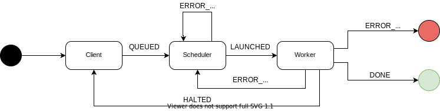
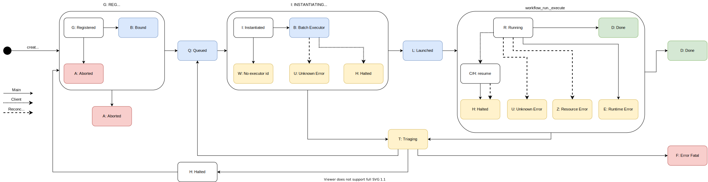

Jobmon's Deployment Units and Finite State Machines
###################################################

Background
**********

Domain Objects
==============

Jobmon currently has four primary domain objects (Task, TaskInstance, Workflow, WorkflowRun). The domain objects are coupled into sets of two. Task and TaskInstance are one pair, and Workflow and WorkflowRun are another. Each pair is organized hierarchically into compute definitions and compute instances.

- TASK: a set of compute instructions.
- WORKFLOW: a super instruction set of Tasks and how they relate to each other.
- TASK INSTANCE: an actualized compute instance of the compute instructions defined by a Task.
- WORKFLOW RUN: an actualized compute instance of the compute instructions definted by a Workflow.

The definition objects (Task and Workflow) can have many instances assocaited with them over time, but only one instantiated instance at any instant in time.

Stateful Deployment Units
=========================

Each domain object can be controlled by one of three stateful deployment units (client, distributor, worker node).

- CLIENT: user interface to jobmon.
- DISTRIBUTOR: creates instances on a worker node.
- WORKER NODE: executes the compute instructions of an instance.

The web service is not considered a stateful actor because it cannot act, it can only transact. (perhaps this is incorrectly concieved??)

Finite State Machine
====================

- FINITE STATE MACHINE (FSM): the finite state machine of a jobmon domain object is the set of states an object can inhabit on each deployment unit, and the allowed transitions between states

Agent Roles
===========

Each deployment unit can act in one of four roles during the progression of a domain object through its finite state machine.

- DEFINER: the agent that decides which compute instructions will execute.
- CONTROLLER: the agent that decides when the defined compute instructions will execute.
- DISTRIBUTER: the agent that decides where the defined compute instructions will execute.
- OPERATOR: the agent that executes the defined compute instructions.

Goal
****

The goal of this document is to propose a simplified system of mapping FSM states onto agent roles and the deployment units that execute them.

Unification of task and workflow
********************************

The finite state machines for task and workflow can be unified. The transitions in each are driven by the progression of associated instance finite state machines. Each deployment unit has a sub-FSM for each type of domain object that it progresses through before entering a terminal state for that deployment unit. The terminal state is a signal for the next deployment unit to begin working, or that an unrecoverable error has been encountered. The deployment unit flow is below with the signal state listed on the arrow.

Universal State Machine
=======================

The deployment unit FSM can be generalized into a universal FSM for progression of tasks and workflows through the deployment units by adding a processing state for each deployment unit. When a depoyment unit has control over the progression of the FSM it is specified by an **ing** verb unique to that deployment unit (REGISTERING, INSTANTIATING, RUNNING). When the deployment unit wants to pass off control it signals using an **ed** word to signal to the next deployment unit that it can claim control. When an error is encountered in the scheduler or executor the web server decides which deployment unit will get control next. Alternatively, if all retries are used then the error is fatal and the FSM terminates. If the client encounters an error it is automatically considered fatal because the object will have insufficient compute instructions to continue execution. This failure mode is designated via the special aborted error. It is appropriate to think of each deployment unit as a while loop waiting for a signal state to begin work. The work is executed in a try/except block that either errors and posts an error signal or finishes and posts a proceed signal. The states below describe the universal finite state machine.

- REGISTERING (G) = client is adding to the requisite metadata to the database, recieving an id
- QUEUED (Q) = client has added all necessary metadata, signal to scheduler to instantiate
- ABORTED (A) = client failed to do all necessary work, scheduler cannot begin instantiation. Fatal
- INSTANTIATING (I) = scheduler is instantiating an instance on the executor
- LAUNCHED (L) = instantiation complete. executor control for tasks or waiting for first scheduling loop for workflows
- RUNNING (R) = actively executing
- DONE (D) = all work has finished successfully
- TRIAGING (T) = encountered an error. Figure out which agent gets control
- ERROR_FATAL (F) = encountered a fatal error or have hit num tries
- HALTED (H) = execution stopped mid run

.. image:: shared_fsm.svg

Detailed Task FSM
*****************

Each **ing** state on a stateful deployment unit has a sub-machine. Filling in the sub-machine for Task Instance gives the figure below.

.. image:: proposed_task_instance_fsm.svg

Of note are the myrad error states that can occur on the scheduler and worker node. Each results in a Triaging state in the universal FSM. Each unique state is driven by a different agent, be it client, scheduler, worker node.

The enumerated roles for each deployment unit in the Task FSM shows potential design issues with the client.

- CLIENT -> DEFINER + CONTROLLER
- SCHEDULER -> DISTRIBUTER
- WORKER NODE -> OPERATOR

In the current implementation of the task instance FSM the client acts as a definer and a controller since the swarm is inside the client and the _adjust_resources_and_queue method is in the swarm. A better solution would be for the swarm to run independently on a worker node as if it were a task. This is preferable because it would increase resiliency since the workflow can be retried from the database. It would also allow the client to disconnect after is fully defines a workflow. If the client api were more robust, and included task defaults, we could even have workflows be started via a CLI.

Detailed Workflow FSM
*********************

Filling in the sub-machine for Workflow Run give the figure below.

The key difference between the Workflow Run FSM and the Task Instance FSM is that the workflow run FSM mandates that the worker node signal back the the process has successfully halted before a new instance can be created. It begs the question whether this pattern should be adopted in the Task Instance FSM as well.

The enumerated roles for each deployment unit in the Workflow FSM show an opportunity for improvement.

- CLIENT -> DEFINER + CONTROLLER + DISTRIBUTER + OPERATOR
- SCHEDULER -> N/A
- WORKER NODE -> N/A

A better solution would be to have the workflow run be run on a Worker Node. The new roles would be the following

- CLIENT -> DEFINER + CONTROLLER
- SCHEDULER -> DISTRIBUTER
- WORKER NODE -> OPERATOR

In a future world would could have the workflow reaper be the controller as well, so the client only defines the computation.

Concrete Proposals
==================

1. Task to use Universal FSM
2. Workflow to use Universal FSM
3. Implement from_db() method for workflow_run
4. Create execution_wrapper for workflow_run to execute on Worker Node
5. Move swarm workflow_run logic to Worker Node
