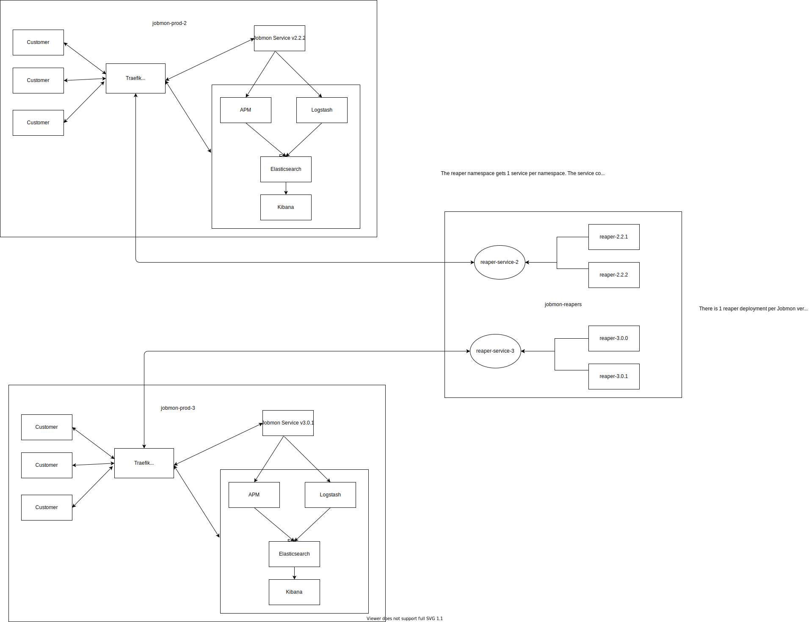

***********
Deployments
***********

TODO: UPDATE THIS PAGE
**********************

Database
########
Beginning with 1.1, each major release has had one database that is shared between all the dot releases.
For example, 1.1.0 through 1.1.5 all share the same database. 2.0.0 through 2.0.4 all share the
same database.

Prior to 1.1 each dot release usually had its own database.
From 2.0 onwards, the database is on a separate VM from the services.
The mysql database runs in a docker container on that VM,
in fact the only docker container on that host.
Therefore it can be configured to use 80% of the memory for its buffers, and use all of the threads.

The data is mounted on a persistent storage volume, mounted to that container.
It is persistent and therefore is not deleted when the container is stopped, or if the images
are pruned.

Critical Database Config Values
*******************************
Check these manually after a new database is created, or after a database reboot

  +-------------------------+----------------------------+
  + Setting                 +  Value                     +
  +=========================+============================+
  + INNODB_BUFFER_POOL_SIZE +  80% of RAM                +
  +-------------------------+----------------------------+
  + WAIT_TIMEOUT            +  600                       +
  +-------------------------+----------------------------+
  + THREAD_POOL_SIZE        +  Set automatically on boot +
  +-------------------------+----------------------------+

Using mysqldump to copy a database
**********************************

On the cluster, run a command like the following:
::
mysqldump -h jobmon-p01.ihme.washington.edu --port 3305 -u docker -p docker --database docker > dbs_3305_dump.sql

Spinning down a database
************************

1. SSH into the host machine, and use "docker ps" to find the container name that corresponds to the database to be spun down.
2. Used "docker stop <container_id>" to stop the container.

Enabling Slow Query Logging
***************************

This negatively affects performance, so only do it in produciton if there really is a problem.
It should be enabled for at least some of the time during load tests prior to a release.
You need to be logged in to mysql as the root user.

.. code-block:: sql

  SET GLOBAL slow_query_log = 'ON';
  SET GLOBAL long_query_time = 2; # in seconds, default is 10
  SET GLOBAL slow_query_log_file = '/path/filename'; # Default /var/log/mysql/mariadb-slow.log

Very Important: You have to log out and in for it to have an effect. You can check by:

.. code-block:: sql

  SHOW VARIABLES;

Turn it off when you are done:

.. code-block:: sql

  SET GLOBAL slow_query_log = 'OFF';

Archiving a volume-based database
*********************************

For versions <=1.0.3.

Refer to db_archiving/create_archive_db.sh for instructions

Removing a deprecated database
******************************

1. Copy the database to a backup location.
2. Spin down the database container.
3. Use "docker inspect -f '{{ .Mounts }}' <container_id>" to find the volume associated with the database. It is usually the first attribute of the value in the first element of the list. For example, volume "jobmon081_mysql-jobmon-emu":

    [{jobmon081_mysql-jobmon-emu /var/lib/docker/volumes/jobmon081_mysql-jobmon-emu/_data /var/lib/mysql local z true rprivate}]

Make sure the database has been copied/backed up before doing the next two steps!

4. Run "docker rm <container_id>" to permanently remove the container from the host machine.
5. Run "docker volume rm <volume_name>" to permanently remove the volume from the host machine.

Historical Port and Host Versions
*********************************
Can be found on the hub at https://hub.ihme.washington.edu/display/DataScience/Jobmon+Version+Record

Docker
######
Basic Steps
***********
1. Clone the jobmon repository
2. Make sure you have docker installed on your local machine
3. From the root of the jobmon directory, run::

    docker-compose -f deployment/docker-compose/docker-compose.yml.local_db_client_services --env-file deployment/docker-compose/.jobmon.ini up -d

4. Once the containers are up and running you can get into the client container to begin running your code by running::

    docker exec -it client bash

5. Once inside the container you can navigate to the /run directory ::

    cd ../run/

6. Where you will see your mounted file system. From there you can run your desired workflow script for example (if the jobmon directory is in the root of your mounted filepath)::

    python jobmon/deployment/tests/local_deploy_workflow_test.py --num 3

7. When you are done running your workflows, stop and remove the containers, remove the images, volume and prune the network

Further Configuration
*********************
Set machine specific configuration in the /deployment/docker-compose/jobmon.ini file

- WEB_SERVICE_PORT: external port to connect to flask services on (default connection is localhost:3000)
- EXTERNAL_DB_PORT: external db port to connect to db on (default is localhost:3306 user: read-only pass: docker)
- LOCAL_PATH: Filepath to mount on the container, default is your root directory: ~/.

How to Run a Workflow Locally
*****************************
The only special configuration for running locally is that you must set the
`executor_class` as either `SequentialExecutor` or `MultiprocessingExecutor` in your Workflow
Object and Task Objects

See the Quickstart docs to get started creating a workflow with tasks to run.

To Access the Local Database
****************************
In a standard sql database management application such as SequelPro or MySQL Workbench, connect to your database at::

    host: 0.0.0.0
    username: read_only
    password: docker
    port: 3306

The jobmon tables will be in the docker database

Kubernetes
##########
Jobmon is deployed on Kubernetes (k8s), for two main reasons. Firstly, it takes advantage of Kubernetes to perform internal networking, so that the different deployment units and monitoring elements can communicate with minimal developer effort. Secondly, the Kubernetes control plane can flexibly scale up and down container instances as needed in order to be flexible with load.

Kubernetes deployments can communicate each other by creating internal services that link container ports, in order to enable data exchange. This is necessary for logging and workflow reaping, for example.

Architecture
************

Since we often need to manage multiple versions of the Jobmon service at one time, the majority of deployment units are grouped together into a single **namespace**. In the above diagram, we have a sample Jobmon deployment, with two concurrent production versions of Jobmon running in separate namespaces. Within each namespace is also an Elastic monitoring stack, responsible for log aggregation and performance monitoring of the Jobmon service.

Inside a namespace, all internal services can reach each other via DNS lookup - Kubernetes assigns the DNS names automatically. External traffic, either external to Kubernetes entirely or from a separate namespace, is all routed through Traefik. Traefik can then route the incoming requests to the appropriate service.

The Jobmon reaper introduces some added complexity to the networking architecture outlined above, where there is 1 version of Jobmon/ELK per namespace. The reaper is dependent on the allowed/disallowed finite state machine transitions, so each version of Jobmon needs its own reaper in order to ensure that new or modified states are accounted for. However, server-side updates with no client-facing changes often are "hot deployed" so that users can take advantage of server upgrades without needing to upgrade their clients. While this is fine for the service as the Jobmon service is stateless, the reaper is not - it depends on database state, so old reapers cannot be spun down and reinstantiated like the service deployment can.

The solution is to move the reapers to a separate namespace. The jobmon-reapers namespace exposes one service per k8s namespace, and forwards web traffic to that namespace's Traefik controller. Then each reaper deployment can simply connect to the reaper service, ensuring that hot deploys and updates can be made to the target namespace without eliminating existing reaper deployments.

Helm
****

Jobmon's kubernetes deployments are managed by Helm, a self-described "package manager for Kubernetes". Rather than deploy individual deployments and services one by one, we can instead define Helm charts to spin up/down the major Jobmon components in the correct order.

Helm charts are deployed to a specific namespace, and can be upgraded or rolled back freely. Helm maintains up to ten versions of a deployed chart.

However, Helm cannot deploy objects to a namespace besides the target namespace. This can be problematic for certain resources, such as Traefik's custom resource definitions and RBACs that are defined in the Rancher global namespace. As a result, global resources still need to be deployed manually.

Additionally, Helm can't truly add or delete resources from a chart definition. For example, the jobmon reapers helm chart only defines a single reaper that is version-specific. When the reapers chart is upgraded in k8s, the existing reaper deployments are then **orphaned** from Helm, meaning that they are no longer managed by the Helm package manager (deletions, updates, etc. must now be done manually).

