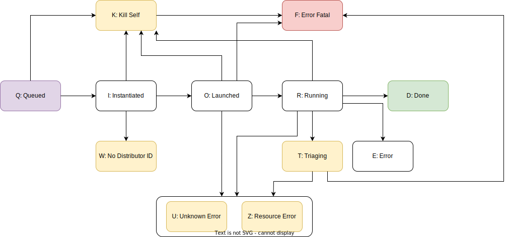
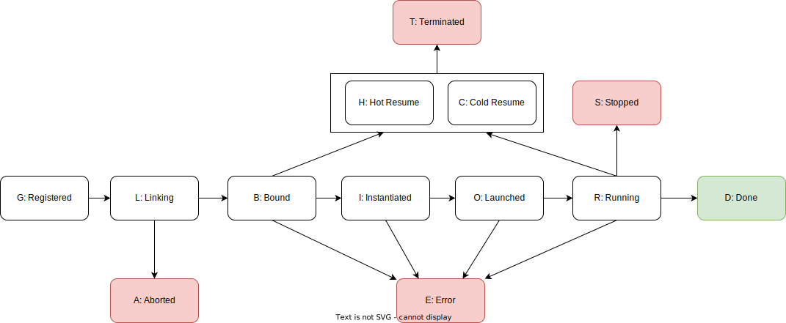

*******************************
Jobmon's Finite State Machines
*******************************

The Finite State Machine (FSM) of a Jobmon domain object is the set of states an object can
inhabit on each deployment unit. It also shows the allowed transitions between states. The
goal of this document is to propose a simplified system of mapping FSM states onto agent roles
and the deployment units that execute them.

Agent Roles
###########

Each deployment unit can act in one of four roles during the progression of a domain object
through its finite state machine.

- DEFINER: the agent that decides which compute instructions will execute.
- CONTROLLER: the agent that decides when the defined compute instructions will execute.
- DISTRIBUTER: the agent that decides where the defined compute instructions will execute.
- OPERATOR: the agent that executes the defined compute instructions.

Unification of Task and Workflow FSMs
#####################################

The finite state machines for Task and Workflow are linked and need to be understood as a pair.
The transitions in each are driven by the progression of associated instance finite state
machines. Each deployment unit has a sub-FSM for each type of domain object that it progresses
through before entering a terminal state for that deployment unit. The terminal state is 1. a
signal for the next deployment unit to begin working, or 2. that an unrecoverable error
has been encountered. The deployment unit flow is below; the signal state is listed on the
arrow.

.. image:: deployment_unit_fsm.svg

Universal Finite State Machine
##############################

The deployment unit FSM can be generalized into a universal FSM for progression of tasks and
workflows through the deployment units by adding a processing state for each deployment unit.
When a deployment unit has control over the progression of the FSM it is specified by
an **ing** verb unique to that deployment unit (REGISTERING, INSTANTIATING, RUNNING). When
the deployment unit wants to pass off control it signals using an **ed** word to signal to
the next deployment unit that it can claim control. When an error is encountered in the
scheduler or executor the web server decides which deployment unit will get control next.
Alternatively, if all retries are used then the error is fatal and the FSM terminates. If
the client encounters an error it is automatically considered fatal because the object will
have insufficient compute instructions to continue execution. This failure mode is designated
via the special aborted error. It is appropriate to think of each deployment unit as a while
loop waiting for a signal state to begin work. The work is executed in a try/except block that
either errors and posts an error signal or finishes and posts a proceed signal. The states
below describe the universal finite state machine.

- REGISTERING (G) = Client is adding the requisite metadata to the database, and receives an ID back.
- QUEUED (Q) = Client has added all necessary metadata; signals to scheduler to instantiate.
- ABORTED (A) = Client failed to do all necessary work; scheduler cannot begin instantiation. This is fatal.
- INSTANTIATING (I) = Scheduler is instantiating an instance on the executor.
- LAUNCHED (L) = Instantiation is complete. Executor in control for Tasks. Waiting for first scheduling loop for Workflows.
- RUNNING (R) = Actively executing.
- DONE (D) = All work has finished successfully.
- TRIAGING (T) = Encountered an error. Figure out which agent gets control and which state the object should move to.
- FAILED (F) = Encountered a fatal error or have hit maximum number of attempts.
- HALTED (H) = Execution was stopped mid-run.

.. image:: shared_fsm.svg

Detailed Task FSM
*****************

Each **-ing** state on a stateful deployment unit has a sub-machine. Filling in the
sub-machine for TaskInstance gives the figure below.

Of note are the myriad of error states that can occur on the scheduler and worker node. Each
results in a Triaging state in the universal FSM. Each unique state is driven by a different
agent: client, scheduler, worker node.

The enumerated roles for each deployment unit in the Task FSM shows potential design issues
with the client.

- CLIENT -> DEFINER + CONTROLLER
- SCHEDULER -> DISTRIBUTER
- WORKER NODE -> OPERATOR

In the current implementation of the task instance FSM the client acts as a definer and a
controller since the swarm is inside the client and the _adjust_resources_and_queue method
is in the swarm. A better solution would be for the swarm to run independently on a worker
node as if it were a task. This is preferable because it would increase resiliency since the
workflow can be retried from the database. It would also allow the client to disconnect after
is fully defines a workflow. If the client api were more robust, and included task defaults,
we could even have workflows be started via a CLI.

Detailed Workflow FSM
*********************

Filling in the sub-machine for Workflow Run give the figure below.

The key difference between the Workflow Run FSM and the Task Instance FSM is that the Workflow
Run FSM mandates the worker node to signal back that the process has successfully halted
before a new instance can be created. Question: Should this pattern also be
adopted in the Task Instance FSM as well?

The enumerated roles for each deployment unit in the Workflow FSM show an opportunity for
improvement.

- CLIENT -> DEFINER + CONTROLLER + DISTRIBUTER + OPERATOR
- SCHEDULER -> N/A
- WORKER NODE -> N/A

A better solution would be to have the workflow run be run on a Worker Node. The new roles
would be the following

- CLIENT -> DEFINER + CONTROLLER
- SCHEDULER -> DISTRIBUTER
- WORKER NODE -> OPERATOR

In a future world would could have the workflow reaper be the controller as well, so the
client only defines the computation.

